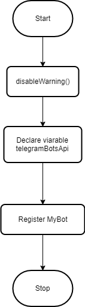
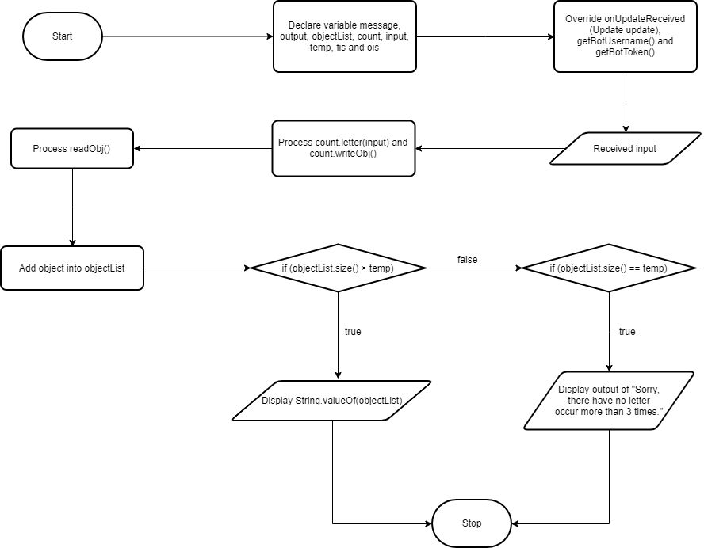
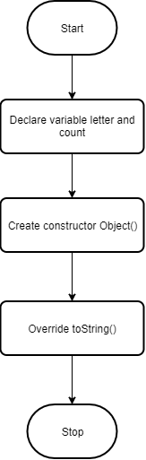
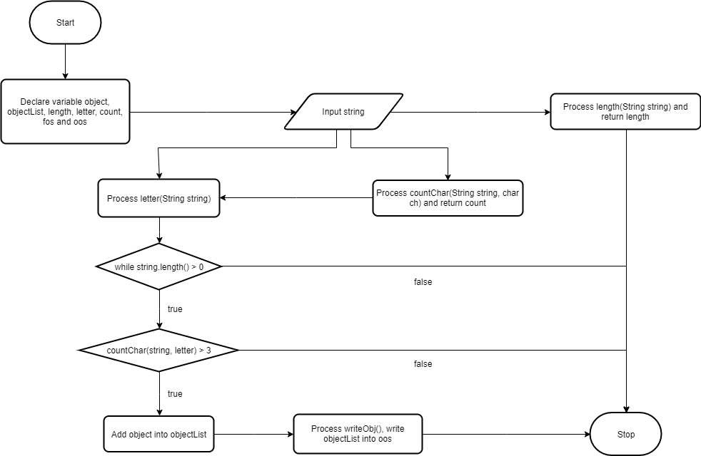
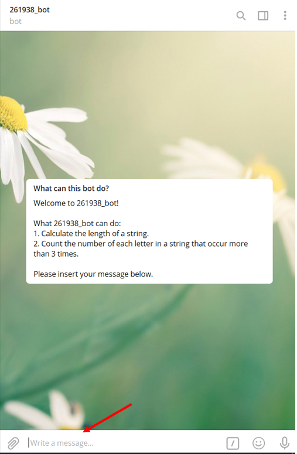
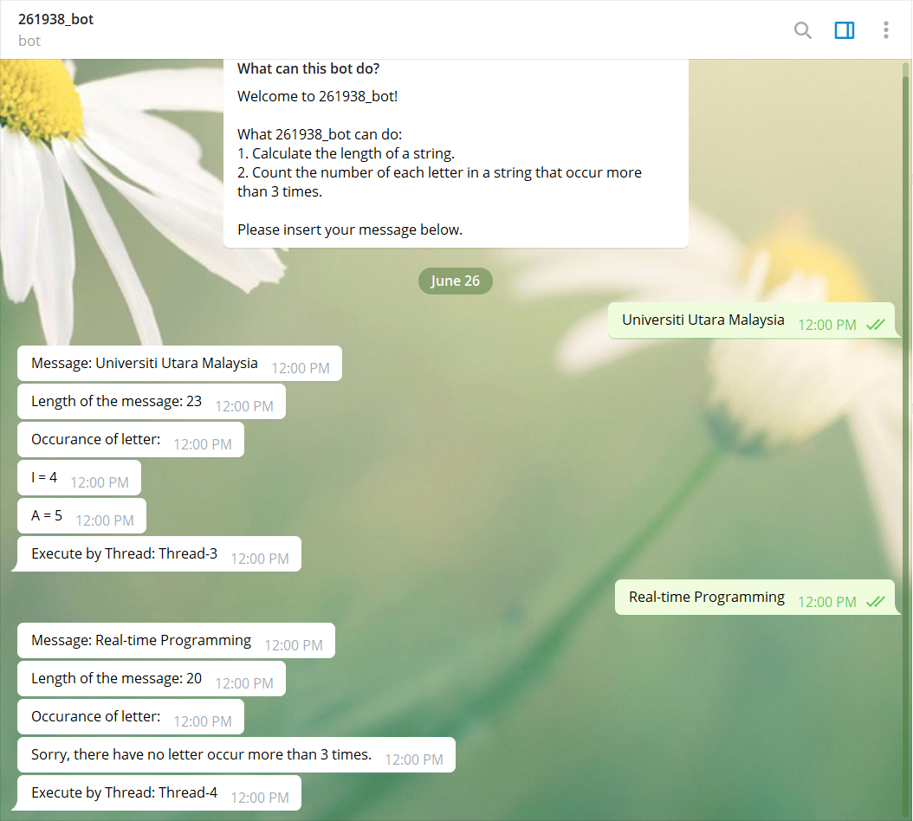
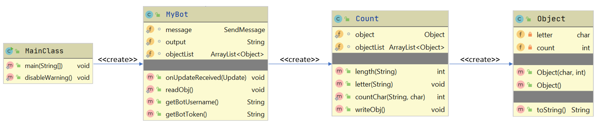

## Student Info:
261938 Lim Wen Liang    
     
     
2. Other related info (if any)

## Introduction
This program runs by using Telegram Bot and IntelliJ Version 2020.1.2 (jdk 14) with Maven Version 1.11.3 and Java programming language. The Telegram Bot has created by Java Library through the Java source code.

## Flow Diagram of the requirements
#### MainClass
  

#### MyBot
  

#### Object
  

#### Count
  

## User manual
*BEFORE RUN THE PROGRAM, MAKE SURE YOUR DEVICE IS CONNECTED TO INTERNET*
1. Open Telegram Bot with this link -> http://t.me/s261938_bot

2. Insert your string inside chat box with your Telegram Bot. 
  

3. Press 'Enter' button, output will be display in few second.

## Result/Output (Screenshot the telegram bots)
  

## UML Class Diagram
  

## Youtube Presentation
https://www.youtube.com/watch?v=TNZUBp-ZfkQ

## References
1. Mix TV. (2018, Feb 18). Mix TV: How to create Telegram Bot in Java [ Tutorial ]. Retrieved from https://www.youtube.com/watch?v=xv-FYOizUSY
2. TalentSprint Coding Prep. (2017, Feb 13). TalentSprint Coding Prep: Java Program to Find the Count of Occurrences of Each Character in a String. Retrieved from https://www.youtube.com/watch?v=OSMHU8mRuFo
3. SoftwareDeveloperNotes. (2020, Jun 15). SoftwareDeveloperNotes: Java IO | How to write & read multiple objects from a file. Retrieved from https://www.youtube.com/watch?v=l__bi60QeBU
4. Tutorials Point. (n.d.). Java Tutorial. Retrieved Jun 24, 2020, from https://www.tutorialspoint.com/java/index.htm